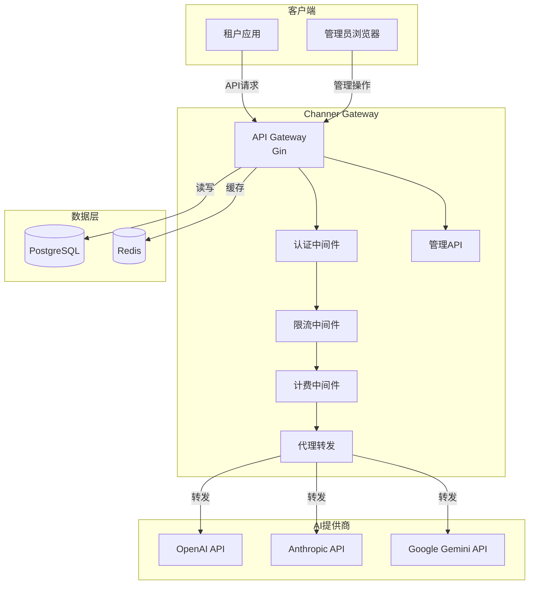
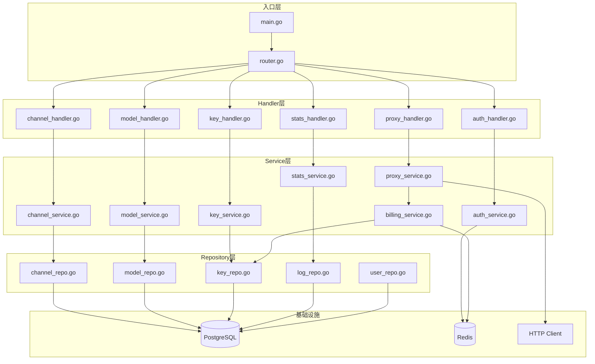
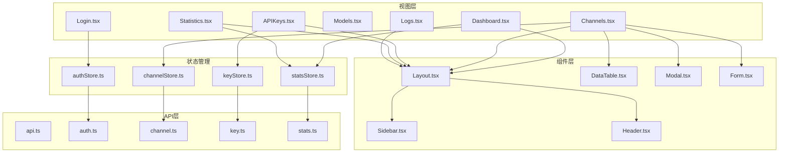
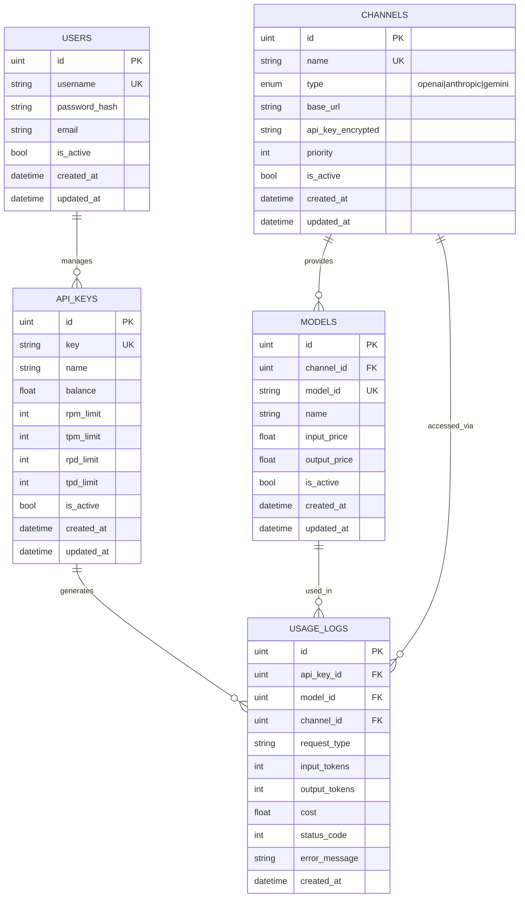
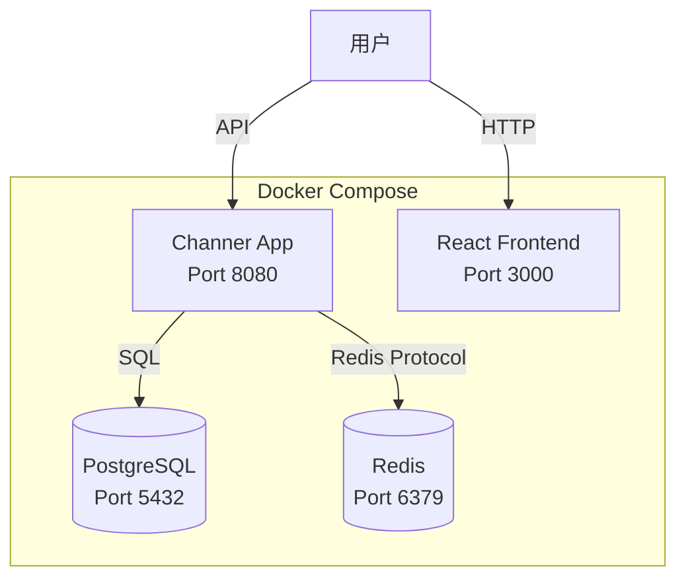

# Channer AI Gateway 技术设计文档

Feature Name: channer-core
Updated: 2026-04-17

## 描述

Channer是一个轻量级个人AI Gateway，支持多租户管理、API代理转发、负载均衡和预付费计费。系统采用Go 1.25开发后端，React开发前端，使用PostgreSQL持久化数据，Redis作为缓存和速率限制存储。

## 架构

### 整体架构



### 后端架构



### 前端架构



## 组件和接口

### 后端组件

#### 1. HTTP Router (Gin)

负责路由分发和中间件链。

**接口:**
- `SetupRouter() *gin.Engine` - 配置路由
- `RegisterMiddleware()` - 注册中间件

#### 2. 认证服务 (AuthService)

处理管理员登录和JWT管理。

**接口:**
- `Login(username, password string) (string, error)` - 登录并返回JWT
- `ValidateToken(token string) (*User, error)` - 验证JWT
- `RefreshToken(token string) (string, error)` - 刷新JWT

#### 3. 渠道服务 (ChannelService)

管理AI提供商渠道配置。

**接口:**
- `CreateChannel(channel *Channel) error`
- `UpdateChannel(id uint, channel *Channel) error`
- `DeleteChannel(id uint) error`
- `GetChannel(id uint) (*Channel, error)`
- `ListChannels() ([]Channel, error)`
- `GetAvailableChannels(model string) ([]Channel, error)`

#### 4. 模型服务 (ModelService)

管理支持的AI模型和定价。

**接口:**
- `CreateModel(model *Model) error`
- `UpdateModel(id uint, model *Model) error`
- `DeleteModel(id uint) error`
- `GetModel(id uint) (*Model, error)`
- `ListModels() ([]Model, error)`
- `GetModelByID(modelID string) (*Model, error)`

#### 5. API Key服务 (KeyService)

管理租户API Key。

**接口:**
- `CreateKey(key *APIKey) error`
- `UpdateKey(id uint, key *APIKey) error`
- `DeleteKey(id uint) error`
- `GetKey(id uint) (*APIKey, error)`
- `GetKeyByString(key string) (*APIKey, error)`
- `ListKeys() ([]APIKey, error)`
- `RechargeKey(id uint, amount float64) error`
- `GetKeyInfo(key string) (*KeyInfo, error)`

#### 6. 代理服务 (ProxyService)

转发请求到AI提供商。

**接口:**
- `ProxyChatCompletions(req *ChatCompletionRequest, key *APIKey) (*ChatCompletionResponse, error)`
- `ProxyResponses(req *ResponseRequest, key *APIKey) (*ResponseResponse, error)`
- `ProxyGemini(req *GeminiRequest, key *APIKey) (*GeminiResponse, error)`
- `ProxyAnthropic(req *AnthropicRequest, key *APIKey) (*AnthropicResponse, error)`
- `StreamChatCompletions(req *ChatCompletionRequest, key *APIKey, w http.ResponseWriter)`

#### 7. 计费服务 (BillingService)

处理预付费计费逻辑。

**接口:**
- `PreDeduct(key *APIKey) error` - 预扣0.1额度
- `FinalizeBilling(key *APIKey, inputTokens, outputTokens int64, model *Model) error` - 修正计费
- `Refund(key *APIKey) error` - 退款
- `CalculateCost(inputTokens, outputTokens int64, model *Model) float64` - 计算费用

#### 8. 限流服务 (RateLimitService)

基于Redis的速率限制。

**接口:**
- `CheckRateLimit(key *APIKey) error` - 检查是否超过配额
- `IncrementCounter(key *APIKey, tokens int64) error` - 增加计数器
- `GetQuotaUsage(key *APIKey) (*QuotaUsage, error)` - 获取配额使用情况

#### 9. 统计服务 (StatsService)

生成用量统计报告。

**接口:**
- `GetDashboardStats() (*DashboardStats, error)`
- `GetKeyStats(keyID uint, start, end time.Time) (*KeyStats, error)`
- `GetChannelStats(channelID uint, start, end time.Time) (*ChannelStats, error)`
- `ExportLogs(filter LogFilter) ([]byte, error)`

### 前端组件

#### 1. 状态管理 (Zustand)

使用Zustand进行轻量级状态管理。

**Stores:**
- `useAuthStore` - 认证状态
- `useChannelStore` - 渠道状态
- `useKeyStore` - API Key状态
- `useStatsStore` - 统计数据

#### 2. API客户端 (Axios)

封装HTTP请求和错误处理。

**接口:**
- `login(credentials)` - 登录
- `getChannels()` - 获取渠道列表
- `createChannel(data)` - 创建渠道
- `getKeys()` - 获取API Key列表
- `createKey(data)` - 创建API Key
- `rechargeKey(id, amount)` - 充值
- `getStats()` - 获取统计

## 数据模型

### 数据库表结构



### 实体定义

#### User (管理员)

```go
type User struct {
    ID           uint      `gorm:"primaryKey"`
    Username     string    `gorm:"uniqueIndex;size:50;not null"`
    PasswordHash string    `gorm:"size:255;not null"`
    Email        string    `gorm:"size:100"`
    IsActive     bool      `gorm:"default:true"`
    CreatedAt    time.Time
    UpdatedAt    time.Time
}
```

#### Channel (渠道)

```go
type Channel struct {
    ID            uint      `gorm:"primaryKey"`
    Name          string    `gorm:"uniqueIndex;size:100;not null"`
    Type          string    `gorm:"size:20;not null"` // openai, anthropic, gemini
    BaseURL       string    `gorm:"size:255;not null"`
    APIKey        string    `gorm:"size:500;not null"` // 加密存储
    Priority      int       `gorm:"default:0"` // 数值越小优先级越高
    IsActive      bool      `gorm:"default:true"`
    CreatedAt     time.Time
    UpdatedAt     time.Time
    Models        []Model   `gorm:"foreignKey:ChannelID"`
}
```

#### Model (模型)

```go
type Model struct {
    ID           uint      `gorm:"primaryKey"`
    ChannelID    uint      `gorm:"index;not null"`
    ModelID      string    `gorm:"uniqueIndex;size:100;not null"` // 如 gpt-4o
    Name         string    `gorm:"size:100"` // 显示名称
    InputPrice   float64   `gorm:"default:0"` // 每1K Token价格
    OutputPrice  float64   `gorm:"default:0"` // 每1K Token价格
    IsActive     bool      `gorm:"default:true"`
    CreatedAt    time.Time
    UpdatedAt    time.Time
    Channel      Channel   `gorm:"belongsTo:ChannelID"`
}
```

#### APIKey

```go
type APIKey struct {
    ID        uint      `gorm:"primaryKey"`
    Key       string    `gorm:"uniqueIndex;size:64;not null"`
    Name      string    `gorm:"size:100;not null"`
    Balance   float64   `gorm:"default:0"`
    RPMLimit  int       `gorm:"default:60"`   // Requests Per Minute
    TPMLimit  int       `gorm:"default:100000"` // Tokens Per Minute
    RPDLimit  int       `gorm:"default:10000"`  // Requests Per Day
    TPDLimit  int       `gorm:"default:1000000"` // Tokens Per Day
    IsActive  bool      `gorm:"default:true"`
    CreatedAt time.Time
    UpdatedAt time.Time
}
```

#### UsageLog

```go
type UsageLog struct {
    ID            uint      `gorm:"primaryKey"`
    APIKeyID      uint      `gorm:"index;not null"`
    ModelID       uint      `gorm:"index"`
    ChannelID     uint      `gorm:"index"`
    RequestType   string    `gorm:"size:50"` // chat.completions, responses, etc.
    InputTokens   int64
    OutputTokens  int64
    Cost          float64
    StatusCode    int
    ErrorMessage  string    `gorm:"size:500"`
    CreatedAt     time.Time `gorm:"index"`
}
```

## 正确性属性

### 数据一致性

1. **余额非负**: API Key的余额不能为负数，IF 余额不足则拒绝请求
2. **渠道唯一性**: 渠道名称必须唯一，IF 重复则创建失败
3. **模型唯一性**: 在同一渠道下，模型ID必须唯一
4. **API Key唯一性**: Key字符串必须全局唯一

### 业务规则

1. **优先级排序**: 负载均衡时，优先级数值小的渠道优先
2. **预付费原则**: 所有请求必须先预扣0.1额度
3. **配额限制**: 超过任一配额限制（RPM/TPM/RPD/TPD）的请求被拒绝
4. **软删除**: API Key和渠道使用软删除，保留历史记录

### 并发安全

1. **余额更新**: 使用数据库乐观锁或Redis原子操作更新余额
2. **配额计数**: 使用Redis INCR命令原子增加计数器
3. **渠道选择**: 使用读写锁保护渠道可用状态

## 错误处理

### 错误分类

| 错误码 | 场景 | 处理方式 |
|--------|------|----------|
| 400 | 请求参数错误 | 返回具体错误信息 |
| 401 | API Key无效 | 提示重新认证 |
| 402 | 余额不足 | 提示充值 |
| 403 | API Key已禁用 | 提示联系管理员 |
| 429 | 超过配额限制 | 提示等待或升级配额 |
| 500 | 服务器内部错误 | 记录日志，返回通用错误 |
| 502 | 渠道返回错误 | 透传渠道错误信息 |
| 503 | 无可用渠道 | 提示稍后重试 |
| 504 | 渠道超时 | 记录失败，返回超时错误 |

### 错误响应格式

```json
{
  "error": {
    "code": "insufficient_quota",
    "message": "API Key余额不足，请充值",
    "type": "billing_error"
  }
}
```

## 测试策略

### 单元测试

- 服务层逻辑测试
- 计费计算测试
- 限流算法测试

### 集成测试

- 数据库操作测试
- Redis缓存测试
- API端点测试

### 端到端测试

- 完整请求流程测试
- 负载均衡测试
- 故障转移测试

### 性能测试

- 并发请求测试
- 延迟基准测试
- 内存使用测试

## 部署架构



## 技术选型理由

### 后端: Go 1.25

- **性能**: 高并发处理能力，适合API Gateway场景
- **轻量**: 编译为单个二进制文件，部署简单
- **生态**: 丰富的HTTP框架（Gin）和数据库ORM（GORM）

### 数据库: PostgreSQL

- **可靠性**: ACID保证，数据一致性
- **功能**: 支持JSON、数组等高级类型
- **性能**: 优秀的查询性能和扩展性

### 缓存: Redis

- **速率限制**: 原生支持原子计数器
- **会话存储**: 快速读写JWT黑名单
- **轻量**: 内存数据库，配置简单

### 前端: React + Vite + Tailwind

- **开发效率**: Vite提供快速的开发体验
- **样式**: Tailwind CSS提供原子化样式方案
- **状态**: Zustand提供轻量级状态管理

## 安全考虑

1. **API Key加密**: 渠道API Key使用AES-256加密存储
2. **密码哈希**: 管理员密码使用bcrypt哈希
3. **HTTPS**: 生产环境强制使用HTTPS
4. **CORS**: 配置允许的跨域来源
5. **输入验证**: 所有输入参数进行严格验证
6. **SQL注入防护**: 使用ORM参数化查询

## 扩展性考虑

1. **水平扩展**: 无状态设计，支持多实例部署
2. **数据库分片**: 可按API Key ID分片日志表
3. **缓存集群**: Redis支持Cluster模式
4. **插件机制**: 预留中间件接口，支持自定义插件
